<p align="center"></p>

# Naka

A merchant-side storefront for AI buyer agents, built for the Razorpay AI
Buildathon (Track 01: AI Growth & Agentic Commerce). Every money action
passes a deterministic policy gate, executes exactly once on Razorpay
test-mode Orders after a server-verified human confirmation, is confirmed
only by verified webhooks or reconciliation, and lands in a hash-chained,
append-only ledger.

## Quickstart (no API keys needed)

```bash
pnpm install
pnpm demo:replay
```

That single command wipes any previous demo database, seeds a fictional
filter-coffee roaster (12 products, 16 variants, Hinglish aliases), boots
the whole server in-process against a deterministic recorded Razorpay
client (no network calls, no keys), and runs an LLM-free scripted buyer
through:

- **S1**, an in-limit purchase, a bounded add-on offered and declined, a
  real (recorded) test-mode order created only after a server-verified
  human confirmation, and payment success via webhook.
- **S2**, a purchase above the merchant's auto-approve threshold,
  escalated, approved from the merchant console, then paid.
- **Bounds checks**, an over-mandate cart, an off-category item, an
  expired mandate, a suspended agent, and an out-of-stock item, each
  correctly `DENY`ed with the exact rule that fired.
- **S3, the engineered failure**, two agents racing for the last unit of
  a variant (one wins, one is denied), a real payment failure, a truthful
  "order created, not paid, nothing charged" message, a retry that opens a
  **new** Razorpay order (never reuses a failed one), a simulated 90-second
  webhook outage, and the reconciler independently confirming the same
  payment and completing the checkout, exactly once.

It ends by verifying the entire hash-chained ledger and prints pass/fail
for every assertion.

## Run the tests

```bash
pnpm test          # gate rule unit tests (one per rule id) + a full HTTP integration test
```

## Run the long-lived server (for a real MCP client, or `RAZORPAY_MODE=real`)

```bash
pnpm cli seed       # one-time: import the catalog, register agents, issue mandates
pnpm server         # boots on NAKA_PORT (default 3000)
```

Then point any HTTP client at `POST http://localhost:3000/tools/<tool_name>`
(unsigned for `search_catalog`/`get_product`, Ed25519-signed for the rest,
see `apps/buyer/src/mcp-client.ts` for the exact signing scheme), or open
`http://localhost:3000/console` (password from `CONSOLE_PASSWORD` in
`.env`, default `change-me`).

## Onboard a merchant (any shop, not just the demo roaster)

With the server running, open **`/onboard`**. Three inputs, a shop name, a
console password, and a catalog JSON (a shoe-shop template is prefilled;
the schema is the same one `naka catalog:import` takes), plus optional
Razorpay **test** keys and two policy numbers. One click creates the tenant
end to end and shows a connection kit:

- the merchant's console login (`/console`, merchant id + password),
- the webhook URL and secret to paste into the Razorpay dashboard
  (`/webhooks/razorpay/<merchant id>`),
- a registered buyer agent's private key and mandate, shown once and never
  stored, and the `.mcp.json` snippet that lets an MCP client shop there.

Merchants are isolated: catalog, checkouts, policy (including the kill
switch), console and webhook secret are all per merchant, and a checkout
naming another shop's variant is refused. The merchant seeded from
`data/catalog.json` keeps working exactly as before and uses the `.env`
credentials. Merchants without Razorpay keys run in recorded mode
(simulated payments), so a demo tenant needs no Razorpay account.

Every onboarded shop also gets a public storefront at **`/shop/<merchant
id>`**, the link to share with humans: the live catalog with stock, the
shop's Telegram bot if one is connected, the MCP snippet, and a plain list
of what the assistant cannot do. The manifest (`/.well-known/naka.json?
merchant=<id>`) points at it.

In the console, clicking any order opens a drawer with every gate rule that
fired on it and the numbers it compared, each payment attempt, the Razorpay
payments and the ledger rows, the "explain this money action" screen. The
same drawer opens from an escalation before you approve it.

Inside the console, **Catalog → Download / Upload** lets a merchant edit
their catalog as a file and put it back; an upload deactivates anything no
longer listed (never deletes, ledger rows and old checkouts still point at
it).

**Give the shop a Telegram bot, self-serve:** Console → Channels → paste the
token from `@BotFather` (`/newbot`, pick a name and a username ending in
`bot`). Naka validates it, mints a buyer agent for the bot, and runs the
bot inside the server, the merchant shares `t.me/<username>` and that's
it. Send the bot `/alerts` from your own Telegram to receive approval
requests there. The server needs an LLM key (`OPENROUTER_API_KEY`,
`GEMINI_API_KEY` or `OPENAI_API_KEY`); the platform pays for the model.
`pnpm telegram:bot` still exists for running a bot by hand, but do not run
it with a token the server is already hosting, Telegram allows one poller
per bot.

## Connect from Claude, ChatGPT or Claude Code (a real remote MCP server)

Every merchant on Naka is a remote MCP server at `https://<host>/mcp/<merchant
id>` (Streamable HTTP), and Naka is its own OAuth 2.1 authorization server
with dynamic client registration, which is what hosted MCP clients expect.

- **Claude.ai / Claude Desktop:** Settings → Connectors → Add custom
  connector → paste the URL → Connect. Naka's consent page explains the
  limits (per-checkout cap, categories, human confirmation) and **Allow**
  mints a buyer agent for that person under the merchant's policy. No token
  to copy. ChatGPT's developer-mode connectors work the same way.
- **Claude Code:** `claude mcp add --transport http naka https://<host>/mcp/<id>`
  then `/mcp` to sign in through the browser; or, for a headless setup,
  paste the kit's `.mcp.json` block, which carries a fixed bearer token.
- **Any other MCP client:** `Authorization: Bearer <agent token>` works too.

Whichever way the token was obtained, `/mcp` resolves it to one registered
agent, its merchant and its mandate, and hands the call to the same
dispatcher the signed HTTP tools use, so the gate, escalations, the pay
page and the ledger are identical. Tokens are stored hashed; suspending an
agent in the console turns its token off at once.

`apps/buyer/src/mcp-server.ts` is the local alternative: a stdio MCP
server that holds the agent's Ed25519 private key and signs every call
itself. The repo root's `.mcp.json` uses it for the demo roaster, and the
kit prints that form too, under "run locally". `pnpm mcp` runs it by hand.

## Deploy it

One container, one SQLite file on a volume. The `Dockerfile`, `render.yaml`
and `fly.toml` are at the repository root; the step-by-step for Railway,
Fly and Render, the environment variables, and how to connect Claude Code
and the Telegram bot to a hosted shop are in [docs/DEPLOY.md](docs/DEPLOY.md).
A fresh deploy seeds the demo merchant on first boot, so `/console` and
`/onboard` work immediately.

## Run the Claude-powered buyer

```bash
# requires ANTHROPIC_API_KEY in .env
pnpm demo:live
```

## Architecture

Naka is one Node process in front of one SQLite file. Everything below
runs inside it: the signed tool API, the remote MCP server and its OAuth
provider, the pay page, the Razorpay webhook receiver, the reconciler, the
merchant console, self-serve onboarding, and one hosted Telegram bot per
merchant. The design rule that shapes all of it: **the model only
proposes**. Deterministic code prices and decides, a human confirms,
Razorpay moves the money, and an append-only ledger explains every step.

### 1. System context

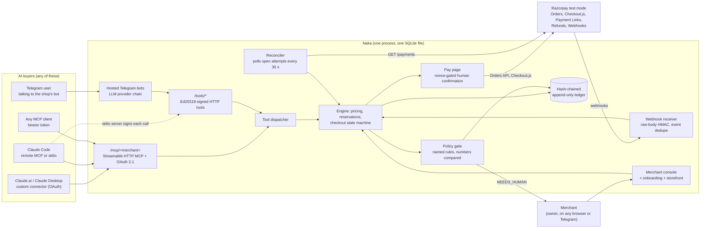

### 2. Repository map

pnpm workspace, TypeScript run directly with `tsx` (no build step), Fastify
5, better-sqlite3, zod, vitest.

```
apps/
  server/            the one deployable: Fastify app, all HTTP surfaces, hosted bots
    src/index.ts       buildServer(): wires every route, the reconciler and the reservation sweep
    src/serve.ts       process entrypoint: boot log, seed on empty DB, listen, start bots
    src/tenants.ts     per-merchant Razorpay clients, key ids and webhook secrets
    src/mcp/           tools.ts (signed routes), dispatch.ts (the eight tools), remote.ts (/mcp),
                       oauth.ts (authorization server), token.ts, signing.ts, schemas.ts
    src/web/           landing, shop (storefront), onboard, console, pay, ui (shared shell), logo
    src/webhooks/      route.ts (raw body + HMAC), apply.ts (event -> engine)
    src/reconcile/     poller.ts
    src/channels/      telegram-host.ts (one runner per merchant), telegram.ts (escalation alerts)
  buyer/             buyer-side programs: stdio MCP server, replay buyer, live LLM buyers, bot CLI
packages/
  shared/            ids, money (paise), canonical JSON, redaction, error types
  db/                schema.sql, migrations, resolveDbPath (local file or platform volume)
  catalog/           import/export, FTS5 + alias search with hit ranking, product reads
  identity/          Ed25519 keys, agent registry, per-request signature verification, nonce replay cache
  mandate/           buyer-signed mandates: caps, categories, expiry, usage accounting
  gate/              pure decision function: rules A1..B7, S1, G2, R1..R3 -> ALLOW / DENY / NEEDS_HUMAN
  engine/            checkout state machine, server-side pricing, reservations, coupons, add-ons,
                     payment lifecycle, refunds, per-merchant policy, failure classification
  executor/          Razorpay side effects: orders (idempotent receipts), payment links, refunds, customers
  razorpay/          real client (test keys only), recorded client (simulated, in-process webhooks), signatures
  ledger/            append with hash chain, verify, CSV export
  channels/          NakaClient (signing HTTP client), tool definitions, system prompt, claim checker,
                     Telegram transport and HTML formatting, LLM provider chain, TelegramBotRunner
cli/                 naka CLI (seed, catalog, agents, ledger, escalations, refunds, kill switch)
tests/               76 tests: money path, tenancy isolation, console, webhooks, MCP, OAuth, page scripts
docs/                DEPLOY.md, logo files
```

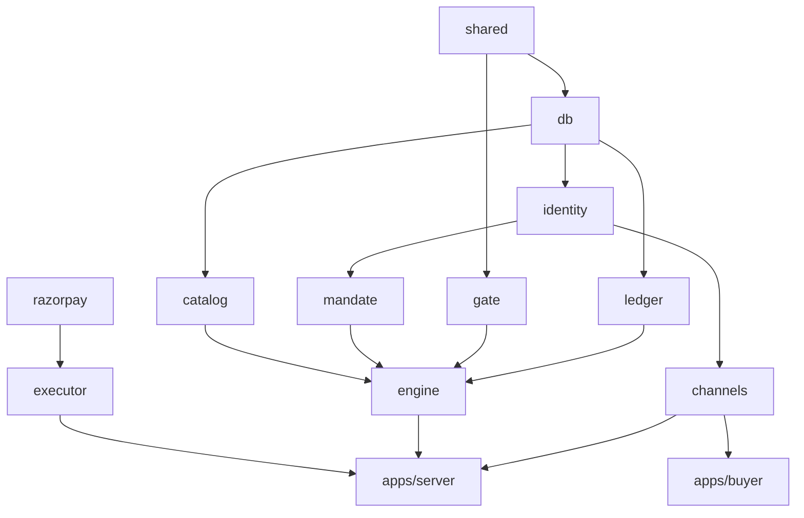

### 3. One purchase, end to end

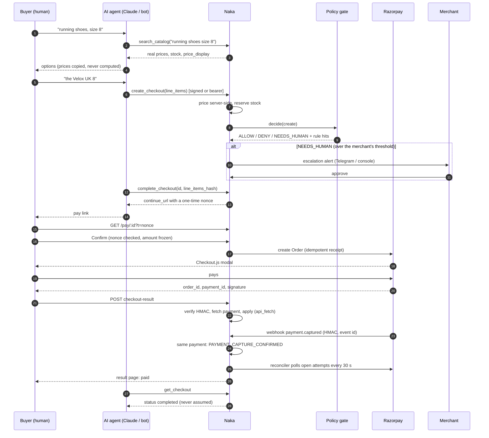

### 4. Checkout state machine

The engine owns every transition. Status ranks are stored next to the
status so a late or duplicate event can never move a checkout backwards,
and a database trigger makes the amounts immutable once a checkout enters
`complete_in_progress`.

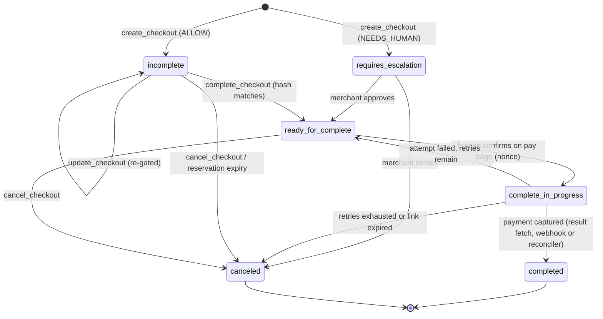

Payment attempts have their own ranks (created, opened, failed,
authorized, captured) and a unique index allows only one open attempt per
checkout, so a retry can never race the attempt it replaces.

### 5. The policy gate

`packages/gate` is a pure function: inputs in, a decision out, no I/O.
Every rule records the two values it compared, and the whole list is
stored on the decision row, so the console can show a merchant exactly why
an order passed, waited, or was refused.

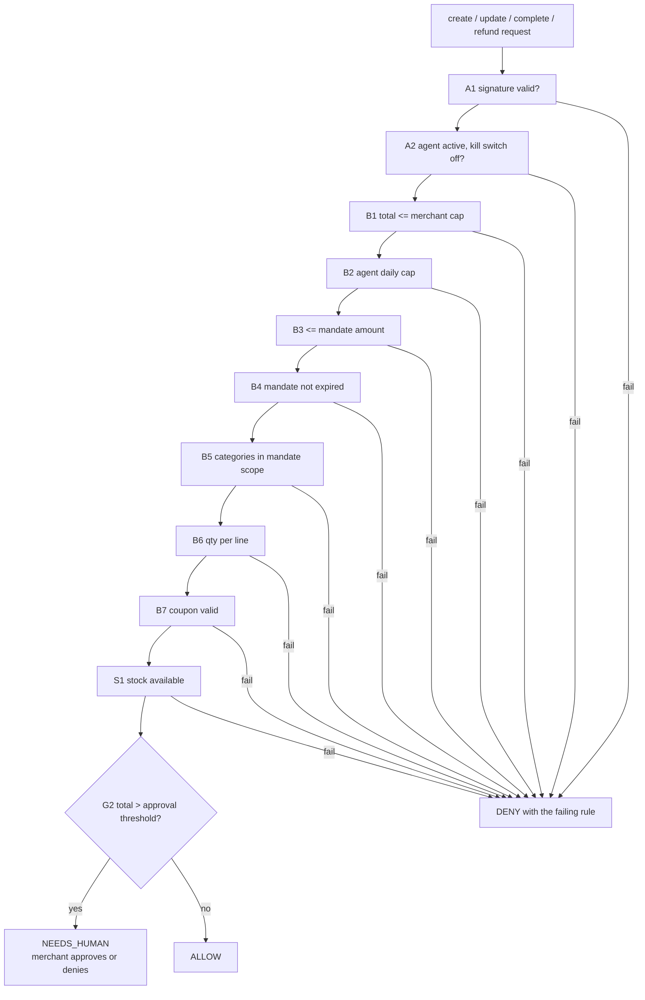

| Rule | What it bounds | Source of the bound |
|---|---|---|
| A1, A2 | the caller is a registered, active agent; the shop's kill switch is off | identity registry, merchant policy |
| B1, B6 | per-checkout amount and per-line quantity | merchant policy (editable in the console) |
| B2 | what one agent may spend per day | merchant policy |
| B3, B4, B5 | amount, expiry and categories the buyer granted | the buyer-signed mandate |
| B7 | coupon exists, applies, within its cap | catalog |
| S1 | stock net of reservations | catalog |
| G2 | orders above a threshold wait for the merchant | merchant policy |
| R1, R2, R3 | refunds: merchant-initiated only, within captured amount, approved separately | engine + gate |

Refunds are never automatic. A refund is requested by the merchant (or
queued by the system for a genuinely surplus payment), gated, approved in a
second step, and only then sent to Razorpay.

### 6. Three doors, one dispatcher

Every buyer path ends in the same eight tools and the same
`runTool(db, ctx, name, args)` function, so the gate, the escalation, the
pay page and the ledger cannot differ by channel.

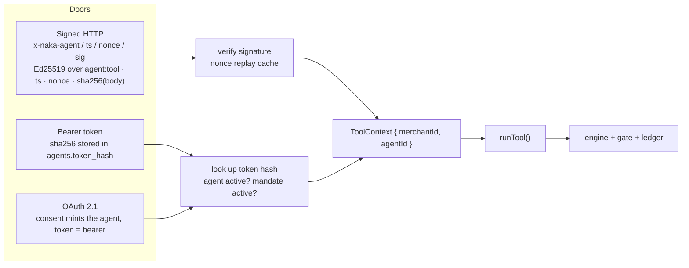

- **Signed HTTP** is for a buyer program that holds its own key: the
  stdio MCP server, the replay buyer, the live LLM buyers. Each call is
  individually signed and replay-protected; a signed call is bound to the
  agent's merchant regardless of any header.
- **Bearer tokens** are for hosted clients with nowhere to keep a key.
  Only the hash is stored; suspending the agent turns the token off.
- **OAuth 2.1** is how the Claude app, ChatGPT and Claude Code's `/mcp`
  sign-in connect: Naka is its own authorization server.

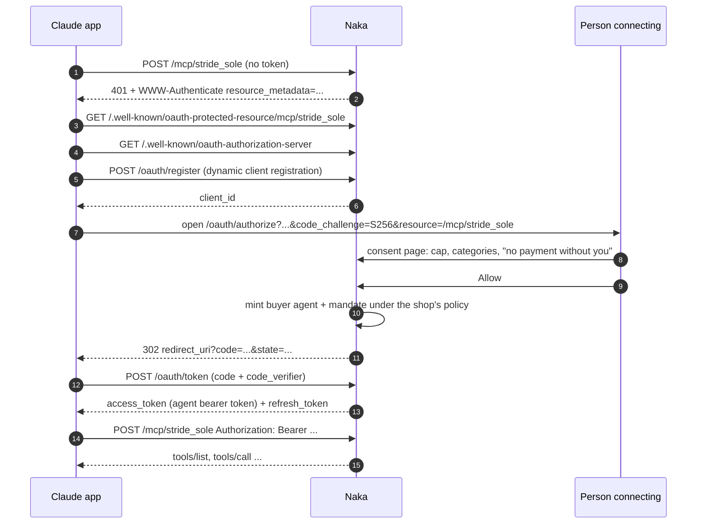

The MCP transport is Streamable HTTP in stateless mode: every request
builds a throwaway `McpServer` bound to the authenticated agent. There is
no session to hijack and nothing to clean up when a client disappears.

### 7. Payment truth, three sources, one function

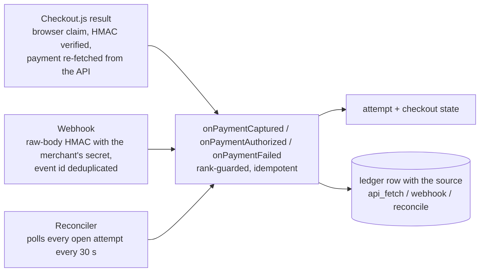

The three paths are deliberately redundant. A dead webhook still settles
(reconciler), a slow webhook does not leave the buyer staring at a result
page (result fetch), and a duplicate never double-applies: a payment the
checkout already holds is recorded as `PAYMENT_CAPTURE_CONFIRMED` with the
path that confirmed it. Only a *different* payment captured against a
finished checkout is treated as surplus, and that queues a refund request
for the merchant rather than refunding automatically.

Failures are classified by a deterministic table (customer decline vs.
bank/gateway vs. other) into what the buyer is told and whether a retry is
offered; retries create a fresh attempt with a fresh idempotent receipt.

### 8. The ledger

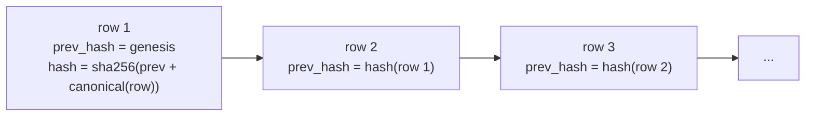

Every money-relevant event (decisions with their rule hits, orders,
payments by source, escalations, refunds, policy edits, agent minting,
webhook rejections) is appended with `prev_hash` and its own hash over the
canonical JSON of the row. A database trigger forbids UPDATE and DELETE.
`Verify chain` in the console recomputes the chain and names the first bad
row; `Tamper demo` edits a row outside the app so the merchant can watch
verification fail. The ledger exports to CSV and every row carries the
actor (agent, gate, engine, webhook, reconciler, merchant, buyer, system).

### 9. Multi-tenancy and the data model

Tenancy is by column, not by database: one SQLite file, every core table
carries `merchant_id`, and every read and write is scoped by it. A signed
call belongs to its agent's merchant; unsigned reads take `x-naka-merchant`;
a cart that names another shop's variant is refused.

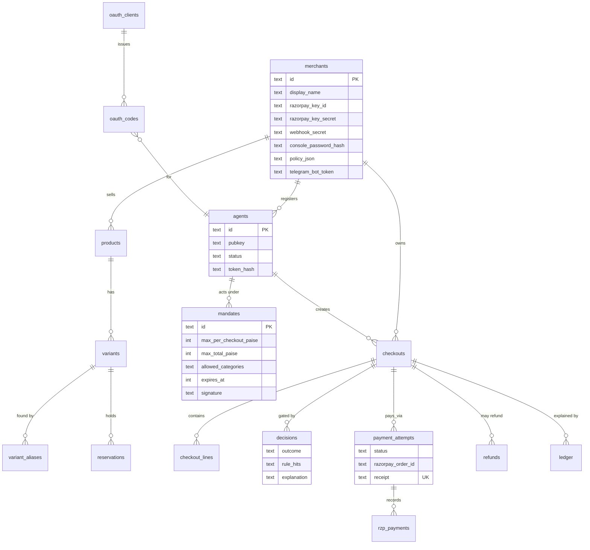

Per-merchant state lives on the `merchants` row: Razorpay test keys
(falling back to recorded mode when absent), webhook secret, console
password hash, policy overrides, and the hosted Telegram bot's token and
agent. Onboarding is one transaction: merchant row, catalog import, policy,
a buyer agent with its mandate, a ledger row.

### 10. The Telegram channel

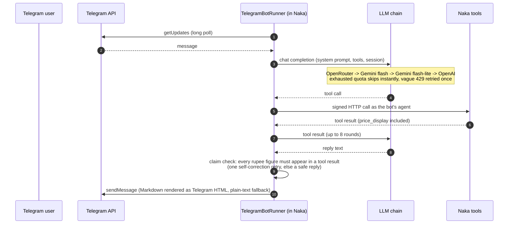

The server hosts one runner per merchant that pasted a BotFather token in
the console (`TelegramHost`); `/alerts` from the merchant's own chat
registers where escalations are delivered. The same runner class powers
the standalone CLI bot.

### 11. Design choices and trade-offs

| Choice | Why | What it costs |
|---|---|---|
| The model only proposes; every decision is deterministic code | A language model cannot be audited, bounded or replayed; a gate can. The merchant's rules are the same on every channel and every model. | The agent cannot "negotiate"; anything not expressible as a rule is a NEEDS_HUMAN. |
| Human confirmation on a nonce-gated pay page, never an API payment | Razorpay test mode has no server-side payment API, and no merchant should let an agent pay unattended. The one-time nonce ties the click to a specific frozen amount. | One extra human step per purchase, by design. |
| SQLite (WAL) in one process | Transactions around every money transition, a single writer, trivially persisted on a platform volume, no operational surface. | One process; scaling out means moving to Postgres, which the schema is written to allow. |
| Per-request Ed25519 signatures for buyer programs | Authenticates every call, not a connection; replay-protected by nonce; the private key never touches the server. | A buyer program must hold a key, which hosted clients cannot do, hence the next two rows. |
| Hashed bearer tokens for hosted clients | Nowhere to keep a key; the hash alone is stored; suspend the agent, kill the token. | A token is replayable within its life (TLS protects it in transit). |
| Naka as its own OAuth 2.1 server | The Claude app, ChatGPT and Claude Code expect discovery + dynamic registration + PKCE; delegating to an external IdP would still need a mapping to agents. The consent page is where the mandate is explained to the person. | About 300 lines of protocol to own and test. |
| Stateless Streamable HTTP MCP | No sessions to hijack or leak; a throwaway server per request is cheap. | No server-initiated notifications (GET returns 405). |
| Three sources of payment truth | Webhooks fail, browsers close, and demos happen on hotel Wi-Fi. The result fetch is fast, the webhook is canonical, the reconciler is the backstop. | Duplicate deliveries must be handled idempotently everywhere (rank guards, event ids, same-payment confirmation). |
| Synchronous webhook processing | SQLite writes take milliseconds, far inside Razorpay's 5 s timeout; a queue would add a failure mode without buying anything. | A very slow disk would cost retries, not correctness. |
| Recorded Razorpay client | Every test and every demo tenant without keys runs the real code path with simulated orders and in-process webhooks. | The recorded client must be kept faithful to the real API's shapes. |
| Hash-chained, append-only ledger in the same database | Tamper-evident without an external log service; verification is a query; the console can demonstrate it live. | Not tamper-proof against someone who rewrites the whole chain; that needs an external anchor. |
| Tenancy by column | One deployment serves every shop; onboarding is a transaction, not an environment. | Every query must remember the scope, which the isolation tests enforce. |
| Server-rendered pages with inline scripts, no frontend build | One process, one language, nothing to compile; the pages are strings. | A bad quote in a string breaks a page silently, so a test compiles every page's inline script with V8. |
| Hosted Telegram bots inside the server | A merchant pastes a token and is live; no second deployment. | The server needs an LLM key and the model's quota is shared across merchants, hence the provider chain. |

### 12. Failure modes handled on purpose

- Webhook route returning 500 (there is a console switch to simulate it): the reconciler completes the order within 30 s and the ledger records `RECONCILED_BY_POLL`.
- Duplicate or out-of-order events: rank guards on checkouts, attempts and payments; event-id dedupe; same-payment confirmation instead of surplus.
- Payment failure: deterministic classification, a fresh attempt with a fresh receipt, retries bounded by policy, stock reservation extended while the buyer retries.
- Abandoned carts: reservations expire and are released by a sweep, so stock is never leaked.
- Prompt injection in product text: tool results are data; the structural test proves a poisoned description cannot change a price, and the claim checker blocks invented figures.
- LLM quota exhaustion: provider fallback with honest messages, visible in the console with the provider that failed and why.
- A suspended agent, a revoked mandate, a flipped kill switch: denied at the gate on the next call, on every channel, without a restart.
- Cross-tenant access: a token or key from one shop cannot read, cancel, upsell on or complete another shop's checkout; the tests try.

### 13. Deployment topology

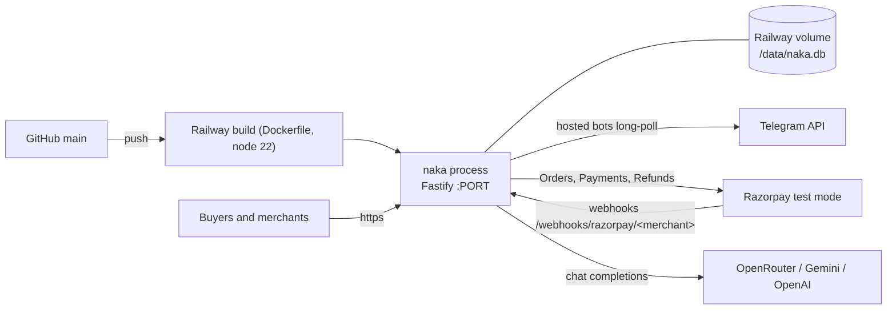

One container, one volume. `resolveDbPath()` picks `NAKA_DB`, else the
platform volume, else `./data/naka.db`; an empty database is seeded on
boot. The same image runs locally with `pnpm server`.

### 14. Where things live

```
apps/server     Fastify server: signed tool routes, /mcp + OAuth, pay page, webhooks, reconciler, console, onboarding, storefront, hosted bots
apps/buyer      buyer agents: replay (no LLM), Claude/OpenAI/Gemini buyers, Telegram bot CLI, stdio MCP server
packages/       catalog · channels · db · engine · executor · gate · identity · ledger · mandate · razorpay · shared
cli/            naka CLI (seed, catalog, agents, ledger, merchant decisions)
data/           catalog.json and policy.json for the demo merchant
tests/          end-to-end and isolation tests (vitest)
docs/           DEPLOY.md, logo
```
